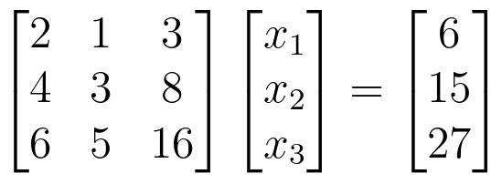
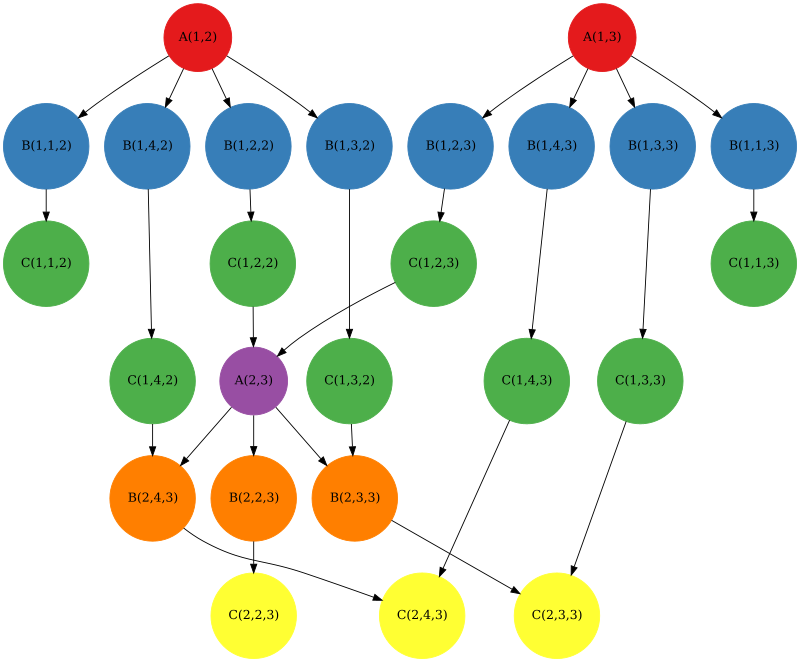
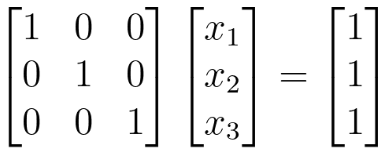
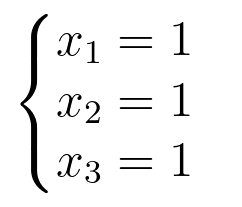

# Concurrent Gauss Elimination
### Description
This is project assignment for AGH UST Theory of Concurrence course about application of trace theory to scheduling threads of concurrent Gaussian elimination. More detailed info and theoretical part explained in [report](https://github.com/piaccho/concurrent-gauss-elimination/blob/main/report_pl.pdf).

### Features
I used Java 17 to implement an algorithm for determining trace theory structures and algorithm for solving system of equations using concurrent Gaussian elimination.
All logic is based on the *ConcurrentGaussElimination* class, which has two main methods:
- *createModel* - used to determine theoretical competences for individual systems of linear equations (determining the alphabet, relations, graph, etc.)
- *solveWithSchedulers* - is used for solving system of equations using the Scheduler's concurrent logic algorithm.

Program generates Diekert's graph in .dot format and renders it to a graphic file in .png format using [GraphvizAPI](https://github.com/nidi3/graphviz-java).

The program includes modified *Checker* and *Generator* classes from the "[checker](https://github.com/macwozni/Matrices)" Java project, which was provided in the task requirements. These classes are responsible for generating examples of system of equations and validating its solutions.

### Input
The program takes three arguments where the third one is optional:
1. input filename
2. output filename
3. size of the random generated system of linear equations 

When running the program with third argument, the system of linear equations of given size is randomly generated instead being imported from input file.

Representation of the system of equations in the file:
- first line - matrix size N (int),
- N next lines - matrix vectors (float),
- last line - RHS vector (float).

Example file:
```
3
2.0 1.0 3.0
4.0 3.0 8.0
6.0 5.0 16.0
6.0 15.0 27.0
```
This input represents this system of linear equations:



### Example

For the above mentioned input, program generate following Diekert graph:



</br>

And gives output:
```
3
1.0 0.0 0.0 
0.0 1.0 0.0 
0.0 0.0 1.0 
1.0 1.0 1.0 
```
Which corresponds to this soluton:






 
